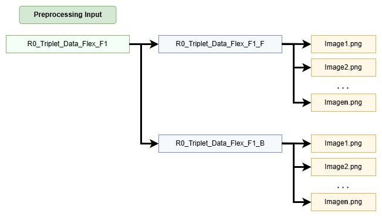

 ```
  ██████╗ ██╗██╗  ██╗ █████╗ ██╗   
  ██╔══██╗██║╚██╗██╔╝██╔══██╗██║     
  ██████╔╝██║ ╚███╔╝ ███████║██║     
  ██╔═══╝ ██║ ██╔██╗ ██╔══██║██║     
  ██║     ██║██╔╝ ██╗██║  ██║███████╗ 
  ╚═╝     ╚═╝╚═╝  ╚═╝╚═╝  ╚═╝╚══════╝
   PIXAL – PIXel-based Anomaly Locator
```

PIXAL (PIXel-based Anomaly Locator) is a modular deep learning framework designed for image-based anomaly detection in high-resolution scientific data. Currently applied to identifying defects in detector hardware components for the ATLAS experiment, PIXAL supports training and validation of deep neural networks, with a focus on Autoencoder-based architectures.

The framework includes tools for:

* Image preprocessing, including background removal, alignment, zero-pruning, and ML input processing

* Flexible training with optional one-hot labels and configurable architectures

* Modular validation and anomaly visualization (heatmaps, ROC, loss histograms)

* Metadata tracking and reproducibility for experimental pipelines

PIXAL is highly extensible — other model types and preprocessing pipelines can be added with minimal changes.

# Setup

PIXAL is tested and works best with **Python 3.10.9**. For consistent results, we recommend creating a clean virtual environment with this version.

### 1. Clone the Repository

```
git clone https://github.com/OSU-HEP-HDL/pixal.git
cd pixal
```

### 2. Setup the Environment
```
source setup.sh
```
This script will:

* Detect your platform (Linux, Windows via WSL or Git Bash, or macOS)

* Create a Python virtual environment in .venv/
 
* Activate the environment

* Install required packages from requirements.txt or requirements-cpu.txt (macOS fallback)

* Set up base configuration files

[!NOTE]
For GPU training, ensure you have a compatible NVIDIA driver and CUDA/cuDNN stack installed. The framework is tested with TensorFlow 2.15+.
[!IMPORTANT]
Note for Windows users: Native Windows is not officially supported. Use WSL2 (Windows Subsystem for Linux) or Git Bash for best results.
[!WARNING]
Note for macOS users: Due to hardware and driver limitations, TensorFlow and related tools will run in CPU-only mode. Training and inference will be slower, but fully functional.

## 3. Verify the Environment

Check to see if the PIXAL framework was properly setup by running the help command.
```
pixal -h
```

# Input Data Formatting

Since components have different types of images, they should be separated in different directories that are labeled accordingly. The framework parses through nested folders and uses the naming convention for the output.



# Configuration System and Parameters

PIXAL uses modular YAML-based configuration files to define preprocessing steps, model training parameters, and all path resolutions. This design enables reproducibility, clarity, and easy experimentation.
There are two main configuration files that can be found within the `/configs` folder, they are `parameters.yaml` and `paths.yaml`. 

## Parameters

The `parameters.yaml` file contains all high-level control flags. The file is split into three sections, `preprocessing`, `model_training`, and `plotting`. 

### Preprocessing

Defines how images are cleaned and transformed:

* remove_background: Max workers are the number of threads for parallel processing when removing backgrounds from the images.
* alignment: parameters for KNN and RANSAC-based image alignment. Includes addtional metric and image flags. 
* preprocessor: controls pooling, zero pruning, color channels, and .npz output.
* rename_images: optionally renames images to folder-consistent names.

### Model Training

Covers everything needed to build and train the neural network:

* Memory handling: GPU/CPU flags, threading, memory growth, and hybrid options.
* Architecture: latent layer size, encoder/decoder depth, label encoding, one-hot encoding flag.
* Training control: batch size, learning rate, optimizer settings, loss functions.
* Regularization: supports l1, l2, or combined with tunable coefficients.
* Early stopping: using patience and min_delta.

### Plotting

Choose what diagnostic plots to generate after training:

* ROC/Recall, pixel-wise MSE/MAE, distribution comparisons, confusion matrix, etc.
* Log-based vs absolute loss plotting.
* Loss cut threshold to define anomaly threshold

